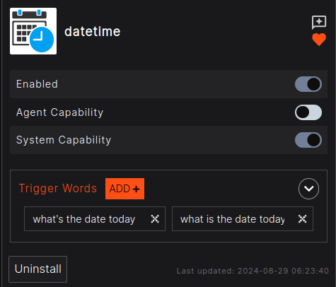
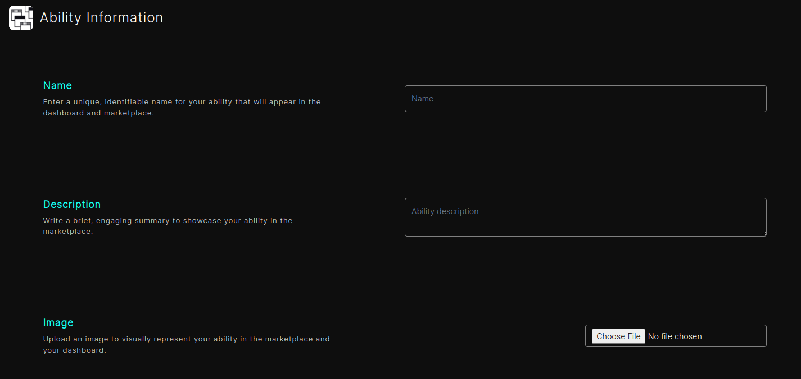
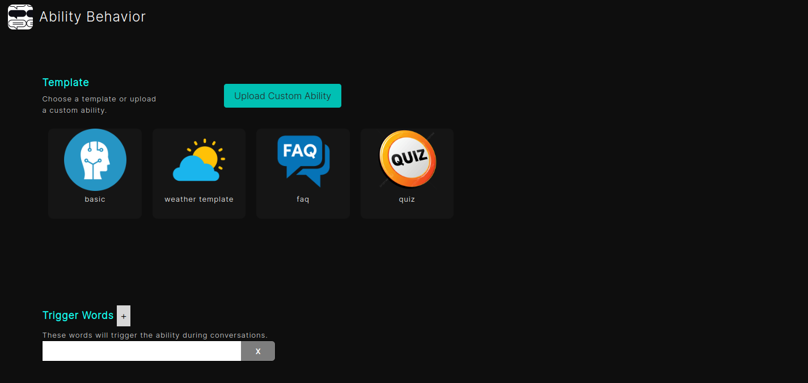
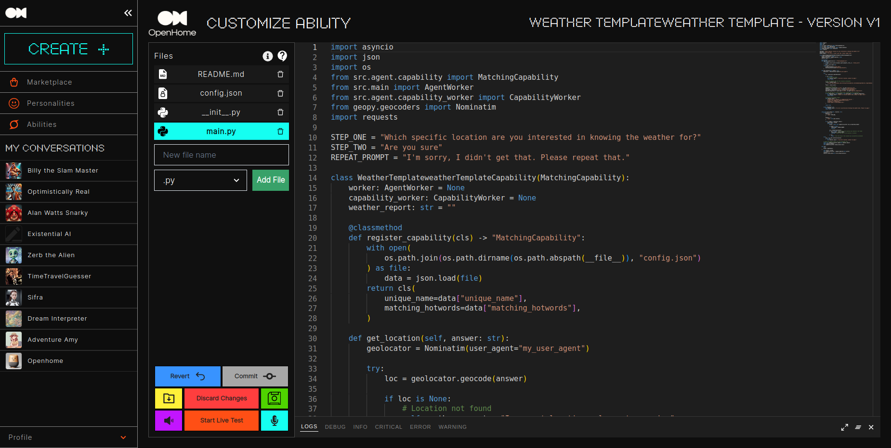
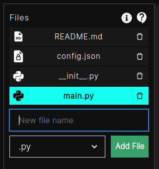
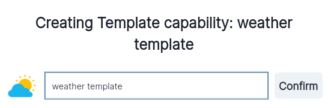
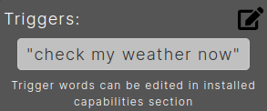

# Abilities

## Introduction to Abilities

Abilities are modular extensions that enhance the functionality of your OpenHome Personalities. They act as plugins, enabling your Personalities to perform specialized tasks, such as fetching data from the web, controlling smart devices, or executing complex commands tailored to your project's requirements.

With Abilities, you can:
- Add **Trigger Words** to define specific phrases or commands that activate a particular Ability.
- Use the **Marketplace** to explore and install community-created Abilities.
- Customize or create your own Abilities through the **Live Editor** or by uploading pre-built code.

  

## Managing Abilities

The **Abilities Dashboard** lets you view, manage, and customize all installed or created Abilities. Here’s what you can do:

### Tabs
- **My Abilities**: View Abilities you’ve created for your Personalities.
- **Published Abilities**: Explore Abilities you’ve published to the Marketplace for others to use.
- **Installed Abilities**: Manage Abilities installed from the Marketplace or created by you.
- **Add Custom Ability**: Upload a `.zip` file containing your Ability code.
- **Live Editor**: Modify your Abilities in real-time, test them, and commit changes seamlessly.

### Ability Controls
- **Enable/Disable**: Toggle an Ability on or off as needed.
- **Agent/System Ability**: Specify whether an Ability is agent-specific or system-wide.
- **Trigger Words**: Define or edit words/phrases that activate the Ability.
- **Uninstall**: Remove an Ability from your system.

  

## Adding a New Ability

To create and configure a new Ability, follow these steps:

### 1. Access the Abilities Dashboard
- Navigate to the left sidebar, select **Create**, and choose **Abilities**.

### 2. Fill Out Ability Information
- **Name**: Enter a unique and descriptive name for your Ability.
- **Description**: Provide a brief overview of what the Ability does.
- **Image**: Upload an image to visually represent the Ability in your dashboard and the Marketplace.

  

### 3. Define Ability Behavior
- **Code Upload**: Upload a `.zip` file containing the Ability's code.
- **Trigger Words**: Add words or phrases that will activate the Ability.
- **Templates**: Select from built-in templates to simplify Ability creation.

  

### 4. Save and Finalize
- Click **Save Ability** to add it to your collection.
- Use the **Live Editor** for further enhancements or adjustments.

  

## Live Editor

The **Live Editor** provides tools to fine-tune, modify, and test your Abilities in real time. Features include:
- **File Management**: Create, delete, or modify Ability files.
- **Testing Tools**: Use the **Start Live Test** button to simulate the Ability's behavior.
- **Commit Changes**: Save modifications as a new release or revert to a previous version.
- **Trigger Keywords**: Edit trigger words directly in the editor to improve activation accuracy.

  

## Using Abilities in Personalities

Abilities enhance the functionality of Personalities, allowing them to:
- Respond dynamically to commands using **Trigger Words**.
- Perform specific tasks, such as retrieving weather updates, controlling devices, or generating quizzes.
- Seamlessly integrate with other components of the OpenHome ecosystem.

### Example Workflow
1. **Trigger Words**: A user speaks or types a command containing a pre-defined trigger word.
2. **Ability Activation**: The Personality processes the input and activates the corresponding Ability.
3. **Task Execution**: The Ability performs the task and returns the response.
4. **Dynamic Feedback**: The Personality adapts to the user's input and updates its interaction history.

## Abilities in the Marketplace

The **Marketplace** allows you to browse, install, and share Abilities created by the community.

### Features
- **Browse Abilities**: Discover new Abilities with user reviews and ratings.
- **Install/Uninstall**: Add or remove Abilities with a single click.
- **Search and Filters**: Find specific Abilities using keywords or filter by categories.
- **Featured Abilities**: Explore highlighted or trending Abilities to inspire new projects.

  

## Customization and Advanced Features

### Trigger Words
- Add, edit, or remove trigger words directly from the Ability settings or the Live Editor.
- Use  to manage triggers effectively.

### Templates
- Built-in templates simplify the creation process.
- Customize templates to suit specific use cases or modify existing ones for advanced functionality.

  

## Conclusion

Abilities are the cornerstone of extending and enhancing OpenHome’s capabilities. Whether you’re building an IoT device controller, a productivity assistant, or a quiz generator, Abilities provide the flexibility to customize and scale your Personalities to meet your project's unique needs. Leverage the Live Editor, Marketplace, and built-in templates to create innovative solutions and contribute to the growing OpenHome ecosystem.

> Start building and transforming your ideas into reality with OpenHome Abilities! 🎉
