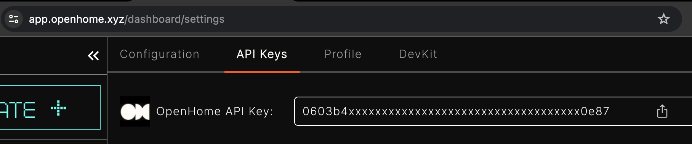

You can get your data through multiple APIs just by using your free OpenHome API Key

You can get your API Key from the <a href="https://app.openhome.xyz/dashboard/settings">Settings</a> Page in the API Keys section.
<a href='https://app.openhome.xyz/dashboard/settings' target='_blank'>
    
</a>

<li>Get Personalities</li>
---

## API Overview

### Fetch Your Personalities

To retrieve the personalities associated with your account, use the following API:

- **URL**: `https://app.openhome.xyz/api/sdk/get_personalities`
- **Method**: `POST`
- **Headers**: None required.
- **Body**:

```json
{
  "api_key": "OPENHOME_API_KEY",
  "with_image": true
}
```
Example response:
```json{
  "personalities": [
    {
      "id": 4727,
      "name": "Default Agent",
      "image":"https://app.openhome.xyz/media/user_personalities/32/image/test.png"
    },
    {
      "id": 5823,
      "name": "Custom Assistant",
      "image":"https://app.openhome.xyz/media/user_personalities/32/image/test.png"
    }
  ]
}
```
