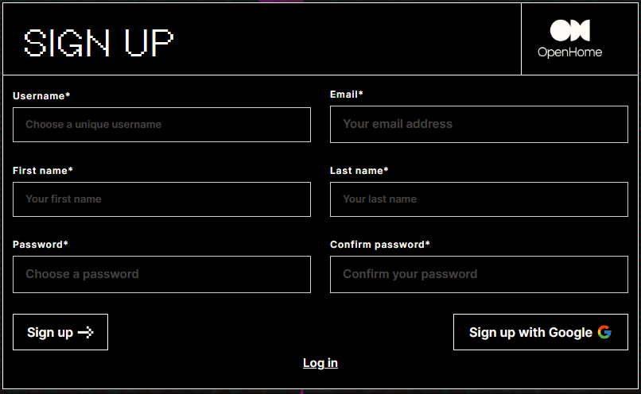

> You can visit your dashboard by going to [app.openhome.xyz](https://app.openhome.xyz)

The web dashboard allows you to:

- **View, create, and modify Personalities** and **Capabilities** associated with your account, as well as explore the public **Marketplace**.
- **Create and manage conversations** and review conversational history with your installed **Personalities**.
- **Configure system settings** and manage provider keys for external services like Text-to-Speech, Large Language Models, and Speech-to-Text vendors.

Our dashboard is powered by the OpenHome SDK, allowing you to directly use the same functionality provided by the OpenHome SDK in your preferred application.

## Access

To use the web dashboard, you'll need to log in or create an account if you haven't signed up yet.

### Logging In

1. Visit [app.openhome.xyz](https://app.openhome.xyz).
2. Enter your Email and Password.
3. Select **Log in** to access your account.
4. Alternatively, you can sign in using your Google account: Select **Sign in with Google**.

### New User Registration

If you’re new to OpenHome, follow these steps to create an account:

1. Select **Sign Up** to create a new account.
2. Fill out the required account information and select **Sign up**.
3. Alternatively, you can sign up using your Google account by selecting **Sign up with Google**.

## Navigation 

- **Capabilities**: View your installed Capabilities that add new skills, tools, or abilities to your Personalities. Capabilities enhance the functionality of your Personalities, giving them specialized skills such as controlling smart home devices, fetching information from the web, or performing specific tasks. You can easily install these capabilities to your existing Personalities or create new ones to suit your needs.

- **Personalities**: Manage your collection of Personalities that are pre-installed within the platform. Each Personality has its own set of configurations, behaviors, and voice settings, designed to handle different use cases. From assistants for personal productivity to specialized agents for enterprise applications, you can modify, customize, or create new Personalities to fit your unique preferences and requirements.

- **Marketplace**: Explore a wide range of additional Personalities and Capabilities developed by the OpenHome community. The Marketplace allows you to browse, install, and customize Personalities and Capabilities that extend the platform’s versatility. Whether you're looking for a ready-to-use solution or inspiration for your own projects, the Marketplace offers a constantly growing selection of community-created resources.

  

## Conversational Dashboard 

The Conversational Dashboard is your central hub for interacting with the Personalities you've installed. Here, you can engage in real-time conversations with your AI agents, testing their behavior and functionality. Whether you're issuing commands, asking questions, reviewing conversational history or testing specific Capabilities, this screen lets you explore how your Personalities respond and adapt.

Here you can also test the functionality of different Capabilities integrated into your Personalities, ensuring they work seamlessly and as expected. This is where you can refine and optimize the conversational experience for your specific use cases.

### Start a Conversation

To begin interacting with a Personality, click the  in the center. This will initiate a new conversation with the selected Personality, allowing you to test responses, behaviors, and capabilities.

### Voice Response Indicator

At the top of the dashboard, there is a waveform indicator that lets you know your selected Personality is responding. The pulsing light reflects the voice output, visually confirming that the system is speaking back to you.

If you don’t hear anything:

- Check your device's and/or browser volume settings to ensure it’s not muted.
- Verify that **Auto Responses** are enabled in the settings, ensuring that the Personality is set to respond aloud (see **Audio & Microphone Control** settings below).

Additionally, the system tracks the response time in milliseconds, displayed below the microphone icon. This shows how long it takes for the system to process and generate a response after receiving your input, helping you monitor the performance of the conversation.

  

## Audio & Microphone Controls

-  Toggles audio on or off. Use this if you don’t want to hear spoken responses.

-  Mutes or unmutes your microphone, depending on your interaction preference.

### Manual Interrupt & Sensitivity

 enables manual interruption during a conversation, useful for situations where you want to stop a Personality mid-response. Adjust the Interrupt Sensitivity slider to control how easily the system accepts interruptions, giving you more flexibility during conversations.

### OpenHome API Key

Your unique OpenHome API key is displayed at the bottom of the dashboard. This key is crucial for authenticating with the OpenHome platform and linking your activities with the system.

  

**Note:** You can also find your API key under **Profile > Settings > API Keys**.

### Conversation Modes: Voice & Text

- The dashboard supports both voice and text-based conversations. 
- You can engage in voice-based conversations by starting a conversation, unmuting your device’s microphone, and speaking your commands directly into it.
- You can use the text input box on the lower right to type out your messages, making it easier to test Personality responses in text form. 
- Type a text command and send it to your Personally the text box at the bottom right of the page. 

  

### Personality Selection 

- Choose from your list of Personalities to engage in a conversation. Each selected Personality will be ready for interaction within the dashboard.
- Conversation Settings: Adjust settings such as Auto Interrupt and other Personality-specific toggles to fine-tune how the AI responds during conversations.

  

### Conversation History

- Your conversation history is available on the upper right side. This allows you to review previous interactions and see how a Personality has responded in past conversations, providing context for ongoing interactions.
- Use the Trash can icon on the top right to delete your conversational history

  

## Settings

In the lower left corner of the **Conversational Dashboard** you can configure your default dashboard settings, adjust your profile, and manage provider keys (for integrating external services like Text-to-Speech or Speech-to-Text).

### Profile Settings

On your Conversational Dashboard, select **Profile > Settings**  to manage your account settings.

  

Optionally, you can also **Logout** of your account from the Profile menu.
