> You can visit your dashboard by going to [app.openhome.xyz](https://app.openhome.xyz)

The web dashboard allows you to:

- **View, create, and modify Personalities** and **Capabilities** associated with your account, as well as explore the public **Marketplace**.
- **Create and manage conversations** and review conversational history with your installed **Personalities**.
- **Configure system settings** and manage provider keys for external services like Text-to-Speech, Large Language Models, and Speech-to-Text vendors.

Our dashboard is powered by the OpenHome SDK, allowing you to directly use the same functionality provided by the OpenHome SDK in your preferred application.

## Access

To use the web dashboard, you'll need to log in or create an account if you haven't signed up yet.

### Logging In

1. Visit [app.openhome.xyz](https://app.openhome.xyz).
2. Enter your Email and Password.
3. Select **Log in** to access your account.
4. Alternatively, you can sign in using your Google account: Select **Sign in with Google**.

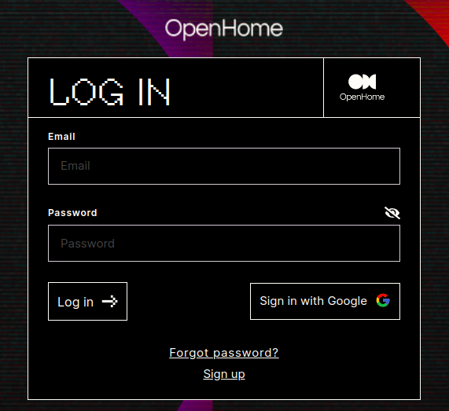

### New User Registration

If you’re new to OpenHome, follow these steps to create an account:

1. Select **Sign Up** to create a new account.
2. Fill out the required account information and select **Sign up**.
3. Alternatively, you can sign up using your Google account by selecting **Sign up with Google**.

## Navigation 

- **Capabilities**: View your installed Capabilities that add new skills, tools, or abilities to your Personalities. Capabilities enhance the functionality of your Personalities, giving them specialized skills such as controlling smart home devices, fetching information from the web, or performing specific tasks. You can easily install these capabilities to your existing Personalities or create new ones to suit your needs.

- **Personalities**: Manage your collection of Personalities that are pre-installed within the platform. Each Personality has its own set of configurations, behaviors, and voice settings, designed to handle different use cases. From assistants for personal productivity to specialized agents for enterprise applications, you can modify, customize, or create new Personalities to fit your unique preferences and requirements.

- **Marketplace**: Explore a wide range of additional Personalities and Capabilities developed by the OpenHome community. The Marketplace allows you to browse, install, and customize Personalities and Capabilities that extend the platform’s versatility. Whether you're looking for a ready-to-use solution or inspiration for your own projects, the Marketplace offers a constantly growing selection of community-created resources.

  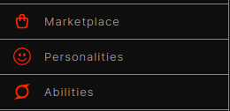

## Conversational Dashboard 

The Conversational Dashboard is your central hub for interacting with the Personalities you've installed. Here, you can engage in real-time conversations with your AI agents, testing their behavior and functionality. Whether you're issuing commands, asking questions, reviewing conversational history or testing specific Capabilities, this screen lets you explore how your Personalities respond and adapt.

Here you can also test the functionality of different Capabilities integrated into your Personalities, ensuring they work seamlessly and as expected. This is where you can refine and optimize the conversational experience for your specific use cases.

### Start a Conversation

To begin interacting with a Personality, click the  in the center. This will initiate a new conversation with the selected Personality, allowing you to test responses, behaviors, and capabilities.

### Voice Response Indicator

At the top of the dashboard, there is a waveform indicator that lets you know your selected Personality is responding. The pulsing light reflects the voice output, visually confirming that the system is speaking back to you.

If you don’t hear anything:

- Check your device's and/or browser volume settings to ensure it’s not muted.
- Verify that **Auto Responses** are enabled in the settings, ensuring that the Personality is set to respond aloud (see **Audio & Microphone Control** settings below).

  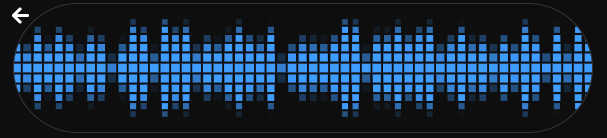

## Audio & Microphone Controls

- 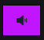 Toggles audio on or off. Use this if you don’t want to hear spoken responses.

-  Mutes or unmutes your microphone, depending on your interaction preference.

### Manual Interrupt & Sensitivity

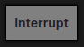 enables interruption during a conversation, useful for situations where you want to stop a Personality mid-response. Adjust the Interrupt Sensitivity slider to control how easily the system accepts interruptions, giving you more flexibility during conversations.

### OpenHome API Key

Your unique OpenHome API key is displayed at the bottom of the dashboard. This key is crucial for authenticating with the OpenHome platform and linking your activities with the system.

  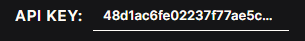

**Note:** You can also find your API key under **Profile > Settings > API Keys**.

### Conversation Modes: Voice & Text

- The dashboard supports both voice and text-based conversations. 
- You can engage in voice-based conversations by starting a conversation, unmuting your device’s microphone, and speaking your commands directly into it.
- You can use the text input box on the lower right to type out your messages, making it easier to test Personality responses in text form. 
- Type a text command and send it to your Personally the text box at the bottom right of the page. 

  

### Personality Selection 

- Choose from your list of Personalities to engage in a conversation. Each selected Personality will be ready for interaction within the dashboard.
- Conversation Settings: Adjust settings such as Auto Interrupt and other Personality-specific toggles to fine-tune how the AI responds during conversations.

  

### Conversation History

- Your conversation history is available on the upper right side. This allows you to review previous interactions and see how a Personality has responded in past conversations, providing context for ongoing interactions.
- Use the Trash can icon on the top right to delete your conversational history

  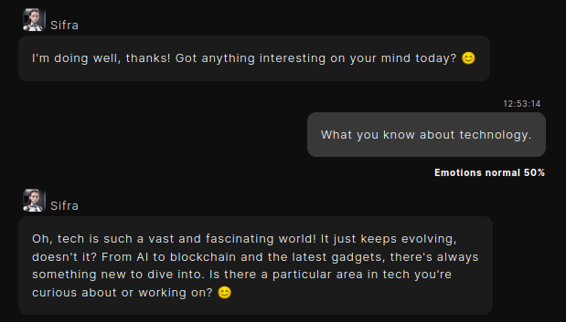

## Settings

In the lower left corner of the **Conversational Dashboard** you can configure your default dashboard settings, adjust your profile, and manage provider keys (for integrating external services like Text-to-Speech or Speech-to-Text).

### Profile Settings

On your Conversational Dashboard, select **Profile > Settings**  to manage your account settings.

  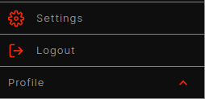

Optionally, you can also **Logout** of your account from the Profile menu.

### Model Configuration Settings

In this settings section, you can customize the providers powering your Personalities and fine-tune their interactions. By adjusting these settings, you can optimize speech processing, response generation, and voice output to meet your specific needs. This gives you control over each component's functionality, allowing you to tailor the interaction experience to your preferences.

#### Settings Overview

- **STT Model (Speech-to-Text Model):** Select the model that will convert speech input into text.
- **STT Platform:** Choose the platform that provides the Speech-to-Text service (e.g., Assembly).
- **TTT Model (Text-to-Text Model):** This is the large language model that will process the transcribed text and generate a response (e.g., GPT-4).
- **TTT Platform:** Choose the provider for the Text-to-Text processing (e.g., OpenAI).
- **TTS Model (Text-to-Speech Model):** Select the model that converts text responses back into speech. The selected voice model will dictate how the Personality sounds (e.g., "eleven_turbo_v2", "eleven_monolingual_v1").
- **TTS Platform:** Choose the platform providing the Text-to-Speech service (e.g., ElevenLabs).
- **Play Filler Audios:** Toggle this setting to play short filler sounds while the system processes speech, indicating it's working on generating a response.
- **Auto Sleep:** Enable or disable automatic sleep mode, which will turn off the Personality after a period of inactivity.
- **FuzzyWuzzy Threshold:** Adjust the sensitivity of the text-matching algorithm. A higher threshold makes the system stricter when matching text input, while a lower threshold makes it more flexible.
- **Auto Sleep Timeout One:** Set the time (in seconds) before the Personality will confirm inactivity.
- **Auto Sleep Timeout Two:** Set the time (in seconds) for the second stage of sleep, where the Personality will fully shut down if inactive.

- **OpenAI TTT Temperature:** Controls the randomness of responses from the LLM. A lower temperature (closer to 0) will make responses more focused and deterministic, while a higher temperature (up to 1) makes responses more creative and varied (Wild Card).
- **OpenAI TTT Frequency Penalty:** Adjusts how often words or phrases can repeat in responses. A higher value will reduce repetition.
- **OpenAI TTT Presence Penalty:** Similar to the frequency penalty, but it discourages the model from introducing new, irrelevant topics. A higher value encourages the LLM to stick to the subject at hand.
- **Voice Similarity Boost:** Adjusts how closely the chosen voice matches its intended sound. A higher boost makes the voice more consistent.
- **Voice Stability:** Controls the stability of the voice output. A lower value makes the voice more varied, while a higher value increases consistency (makes the voice more monotone).

### API Key Settings

OpenHome uses various providers to communicate with TTT (Text-to-Text), LLM (Large Language Models), TTS (Text-to-Speech), and STT (Speech-to-Text) vendors.

You can set your provider keys to customize the services that power your Personalities. These keys will be used to access the models that power all of your OpenHome Personalities globally.

- Select the 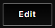 button to edit your desired API key field.
- Select the 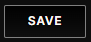 button to finalize your changes.

  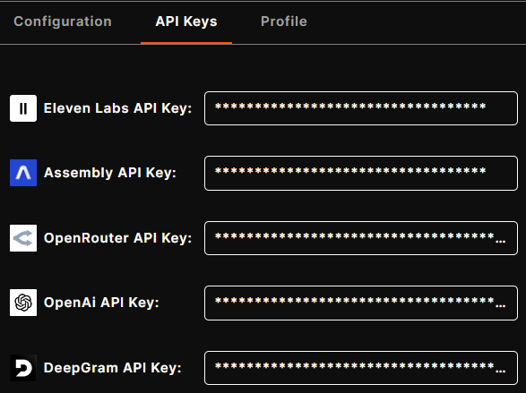

> **Note**: When you update these API keys, your Personalities may consume credits from the associated services linked to the keys, which could result in charges from the respective providers. OpenHome is not responsible for these charges. 

## Profile Settings

This screen allows you to manage and update your profile settings within OpenHome.

- Click the 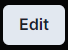 button to modify any of the information, including username, email, and other personal details.
- Click the  button to finalize any setting changes.

### Profile Information Overview

- **User Name:** This is the unique username associated with your OpenHome account.
- **First Name & Last Name:** Displays the personal name details linked to your account. These can be edited to update your profile.
- **Email:** The email address associated with your OpenHome account. This is where you’ll receive notifications and account-related updates.
- **Sync with Community:** This indicates whether your account is synced with the OpenHome community.
- **About:** A section where you can provide a brief description about yourself or your account for the OpenHome community.
- **API Key:** Your unique private API key used for accessing OpenHome services.

- **Change Password:** Update or change your current account password.
- **Joined:** This shows the date and time when you initially created your OpenHome account.
