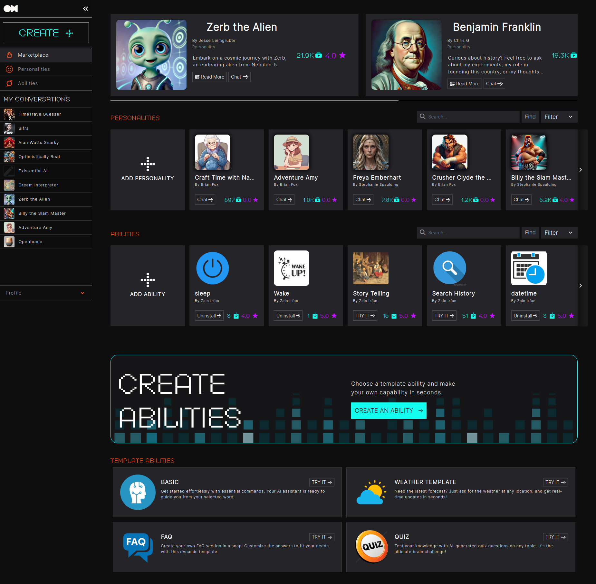

OpenHome is an AI-powered voice interaction platform designed to help developers transform any device into a smart, voice-enabled system. With our Voice SDK, you can build natural, conversational experiences across a wide range of hardware devices and applications. Whether you're working on smart home tech, IoT devices, or enterprise solutions, our platform provides the tools you need to integrate advanced voice interaction seamlessly.

At OpenHome, we believe in the power of community-driven development. Our mission is to create technology that’s not only cutting-edge but also accessible. Whether you’re a seasoned developer or just starting out, OpenHome offers the tools necessary to contribute to a versatile and customizable Voice AI ecosystem..

With our Voice SDK, you can transform any device into a smart, voice-enabled system. From smart homes and IoT devices to enterprise applications, we empower you to build seamless, natural voice interactions. OpenHome is simple to get started with, yet powerful enough to fuel your most ambitious projects.

This documentation is your guide to integrating and scaling with OpenHome. Here, you’ll find everything from quick-start guides to advanced technical resources to help you create the future of voice interaction.

We’re not just building a product—we’re creating an ecosystem where every idea counts and contributes to a broader collective. We are committed to empowering developers with the flexibility to create powerful voice experiences across industries.

Let’s build the future of voice together.

## How OpenHome Works

At the heart of OpenHome is a dynamic, evolving ecosystem designed to offer personalized voice interactions far beyond simple commands. The core architecture revolves around customizable **Personalities** (agents). These Personalities continuously evolve based on user interactions, allowing for deeply personalized voice experiences. With **Abilities** (plugins) to expand functionality and an open **Marketplace** to share and discover new community-driven Personalities and Abilities, OpenHome offers an ever-evolving ecosystem that fosters collaboration and innovation.

## Personalities: Customizable AI Agents

**Personalities** are the core of the OpenHome ecosystem, functioning as customizable AI voice agents tailored for specific use cases. Each Personality is defined by several attributes, including its Description and Purpose, which outlines its role and behavior, Dynamic Feedback, allowing the Personality to adapt based on user interactions, and Voice, which can be personalized to suit your preferences.

## Abilities: Extending Functionality

Once a Personality is created, it can be enhanced with additional **Abilities**. These are like plugins that add new skills, tools, or abilities to your Personality, allowing you to further customize its functionality and tailor it to your needs and project use-case.

## Marketplace: Share and Expand

The **OpenHome Marketplace** allows users to upload, share, and discover Personalities and Abilities created by the community. Once you've developed a Personality or enhanced it with custom Abilities, you can upload it to the Marketplace to share with others. Developers can also browse, install, and modify Personalities and Abilities built by the community, giving them a head start on projects and expanding the ecosystem's versatility. The Marketplace fosters collaboration and innovation, making it easier for developers to contribute to and benefit from the OpenHome ecosystem.

## Project Architecture Overview

### The Heart of OpenHome: A Dynamic, Ever-Evolving System

At the core of OpenHome is a unique and powerful loop that continuously evolves the personality of your smart speaker. This isn't just about responding to commands; it's about creating an experience that's deeply personal and constantly refreshing. Every interaction with OpenHome is a step towards a more nuanced and tailored experience.

### How It Works: The Magic Behind the Scenes

- **Dynamic Personality**: OpenHome begins with a foundation of diverse personalities, each ready to provide a distinct interaction experience. But here's the twist – these personalities aren't static. They evolve with every conversation, adapting to your preferences, your style, and your world.
  
- **Seamless Interactions**: Through our advanced audio module, OpenHome listens and understands, converting your spoken words into a digital format that it can process. This is where the conversation begins.

- **Smart Processing**: Leveraging the power of over 20 different large language models (LLMs), OpenHome intelligently processes your input. Whether it's a command, a query, or casual chatter, the system is designed to understand and respond in the most relevant way.

- **Personalized Responses**: The heart of OpenHome beats in its ability to learn from each interaction. Using our `DynamicPersonalityConstructor`, the system crafts responses that aren't just accurate but also personalized, taking into account your history and preferences.

- **Audible Magic**: What good is a smart response if it can't be enjoyed? Our text-to-speech module brings the conversation to life, turning text responses into natural, fluent speech.
