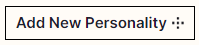
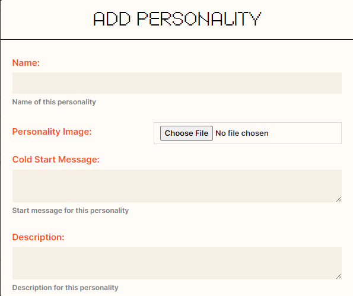
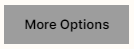
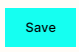
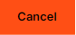
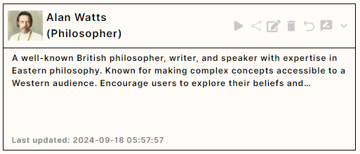
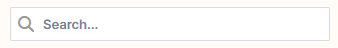
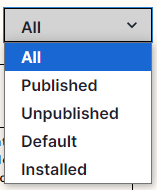

At the heart of the OpenHome ecosystem are **Personalities**—customizable AI voice characters or agents designed for specific tasks and applications. Each Personality is characterized by several key attributes, including:

- **Description and Purpose**: Defines the Personality’s role and how it behaves within the chosen LLM.

- **Voice**: You can tailor the voice to best represent the Personality, aligning with your preferences or project needs.

- **Dynamic Feedback**: Personalities evolve based on user interactions, learning from conversations to provide more personalized responses over time. OpenHome's **DynamicPersonalityConstructor** enables Personalities to evolve with every conversation. They adapt to your conversation history, preferences, and personal style, creating an ever-improving interaction experience. This ensures that the conversation isn’t just accurate but also deeply personalized, making every interaction feel more intuitive.

### How Personalities Work

The core architecture revolves around three key modules: **STT Transcription** (Speech-to-Text), **TTT Processing** (Text-to-Text), and **Voice TTS** (Text-to-Speech). These modules work together to create rich, adaptive experiences powered by customizable "Personalities".

#### Workflow

1. **Speech Input:** The system listens for voice commands, initiated by a cold start message.
2. **STT Transcription:** The Speech-to-Text (STT) module converts speech into text.
3. **LLM Processing:** The transcribed text is processed by the designated LLM (the “brains” of the assistant, the large language model), which generates a relevant response based on the user's input and conversation history. OpenHome supports over 20 different LLMs.
4. **TTS Synthesis:** Once a response is generated, it’s converted back into speech using customizable voices, creating a natural, interactive experience. This module brings the conversation to life with fluent, human-like speech.

## How to Create & Manage Personalities 

The **Personalities dashboard** allows you to view, manage, and create custom AI Personalities. You can also customize the interaction experience by adding new voices.

### Creating New Personality

To get started, visit the Personalities dashboard, and select the  button at the top right of the page and input the following information:

- **Name**: Enter the name of your Personality (We suggest something unique and identifiable). This is the name that will be used to identify your Personality in the dashboard and marketplace (optional). Note that your Personality will be aware of this name as an identifier.

- **Personality Image**: Upload an image to represent this Personality. This image will be used in the marketplace to represent your Personality.

- **Cold Start Message**: Personalities can optionally be configured with an opening message or greeting. This first message will be spoken by your Personality when you first start a new conversation. Certain use cases require a first message, while others do not.

- **Description**: The description serves as the first System Prompt for your Personality. It is the first prompt in the message list fed to the LLM, and it sets the foundation for how the Personality behaves. Use the description to define the context, role, personality traits, and specific instructions, shaping the way the Personality responds and interacts. 

- **Purpose**: Specify the Personality’s intended role or function, further refining your description. By adding additional context, you help the LLM understand the job or role associated with the Personality, ensuring it behaves in a more accurate and relevant way based on its function.

- **Voice ID**: Select a voice from the list to determine how the Personality will sound. Use a pre-installed voice or add your own Voice ID.

  

Explore Additional Personality Options:

To access additional Personality configurations, click the  button to reveal the following fields:

- **Text-to-Speech:** Enter the text used to preview the voice that's selected for your Personality.
- **Gender:** Choose the gender identity for the Personality. This helps customize how the AI agent interacts, particularly if the voice or tone needs to reflect specific characteristics.
- **Language:** Select the language the Personality will use for communication. This setting determines the language in which the Personality will respond. You can interact with your Personality in any of the supported languages, and it will respond in the language selected.
- **Information:** Add any extra details or context about the Personality. This field can be used to provide more background information or clarify the Personality's knowledge base and expertise.
- **Profile Image:** Upload a custom image to visually represent the Personality. This is optional but adds a personalized touch, helping distinguish different Personalities in your dashboard.
- **Key Features:** List the unique abilities or functions the Personality is equipped with. These features provide insight into what the Personality can do, such as specific commands or tasks it is optimized for.
  > **Note:** These tags are for labeling use. It does not inject any additional context into your Personality.

Once the required fields are filled:

- Select the  button to finalize and create the new Personality.
- If you change your mind, select the  button to discard the process.

### Managing Personalities

The **Personality page** allows you to view, manage, and organize all the Personalities you have created or installed from the Marketplace. Each Personality is displayed as a card, showing key details such as its description, last updated timestamp, and options for further customization or interaction.

  

- **Search**: Use the search bar at the top to quickly find a specific Personality by name.

  

- **Status Filter**: The dropdown menu in the top right allows you to filter Personalities by status, including Published, Unpublished, Default, and Installed.

  

