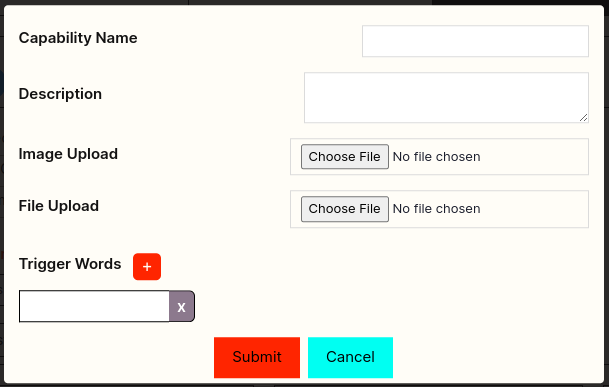

## Accessing the OpenHome Dashboard

### Login
- Go to the OpenHome Dashboard.
- Enter your Email and Password.
- Click `Log in` to access your account.
- Alternatively, you can sign in using your Google account by clicking `Sign in with Google`.

### New User Registration
- If you're new to OpenHome, click `Sign up` to create a new account.
- You can also sign up using your Google account.

## Navigating the Home Page

### Home Dashboard Overview
- **Capabilities:** Access default capabilities provided by OpenHome.
- **Personalities:** View and manage preinstalled personalities.
- **Marketplace:** Browse additional personalities and capabilities.

### Using the Dashboard
- **Start Conversation:** Click the red button to initiate a new conversation.
- **Audio & Mic:** Use the purple button to turn off audio and the sky blue button to mute your mic.
- **Manual Interrupt:** The yellow button allows manual interruptions. Adjust sensitivity using the slider.
- **API Key:** Your unique API key is displayed at the bottom.
- **Conversation Modes:** You can have text-based conversations using the box on the lower right side.
- **History:** Review your conversation history on the upper right side.
- **Settings:** Located on the lower left, configure SDK settings and adjust your profile.

### Managing Personalities

#### Create
- Create a new personality by clicking the `+ Create` button.
- **Settings:** Adjust alerts and other settings for each personality.

## Personalities Page

The Personalities page allows you to view, manage, and create custom AI personalities. You can also add new voices to customize the interaction experience further.

### Managing Personalities
- **Search:** Use the search bar to find specific personalities quickly.
- **Edit or Delete:** Use the icons next to each personality to edit or delete them.

### Create New Personality
- Click `Add New Personality`.
- Fill in the required fields: Name, Cold Start Message, Description.
- Upload a Personality Image if desired.
- Click `Save` to add the personality.

### Advanced Information
- **Purpose:** Define the purpose of the personality, explaining its intended use or function.
- **Voice ID:** Select a voice from the dropdown list to use for this personality.
- **Text to Speech:** Write text and click on the play button to hear the selected voice.

### Finalizing
- Click `More Options` to explore additional settings.
- Click `Save` to finalize the personality setup.
- If you need to cancel the process, click `Cancel`.

### Add New Voice
- Click `Add New Voice id`.
- Provide the Name, Description, and Voice ID.
- Click `Save` to apply the new voice.

### Additional Actions
- **Play:** Preview the personality by clicking the play icon.
- **Share:** Share a personality with others.
- **Reset:** Reset a personality's settings to default.

## Capabilities Page

The Capabilities page allows you to manage and customize the functionalities available in OpenHome. You can view installed capabilities, add new ones, and configure trigger words.

### Managing Capabilities
- **Tabs:**
  - **My Capabilities:** View all custom capabilities you have created.
  - **Published Capabilities:** View all custom capabilities you have published.
  - **Installed Capabilities:** Manage all installed capabilities.

### Capability Controls
- **Enable/Disable:** Toggle a capability on or off.
- **Agent/System Capability:** Specify the type of capability.
- **Trigger Words:** Add or remove words/phrases that trigger the capability.
- **Uninstall:** Remove a capability from your system.

### Add New Capability

#### Basic Information
- **Capability Name:** Enter the name of the capability.
- **Description:** Provide a description of what the capability does.
- **Image Upload:** Upload an icon to represent the capability.
- **File Upload:** Upload a `.zip` file containing the capability code.
- **Trigger Words:** Add words or phrases that will trigger this capability.

#### Finalizing
- Click `Submit` to add the new capability.
- Click `Cancel` if you wish to discard the changes.

## Marketplace

The Marketplace page in OpenHome allows you to browse, install, and manage various personalities and capabilities to enhance your experience.

### Capabilities Marketplace
- **Browse Capabilities:** View available capabilities, including their descriptions, triggers, and ratings.
- **Install/Uninstall:** Click `Install` to add a capability or `Uninstall` to remove it.
- **Search:** Use the search bar to find specific capabilities quickly.

### Personalities Marketplace
- **Browse Personalities:** Discover a variety of AI personalities, complete with ratings and key features.
- **Install:** Click `Install` to add a personality to your collection.
- **Featured Personalities:** Explore highlighted personalities with detailed descriptions and ratings.

### Navigation
- **Pagination:** Use the pagination controls to navigate through different pages of capabilities or personalities.
- **Filters:** Apply filters to narrow down your search results.