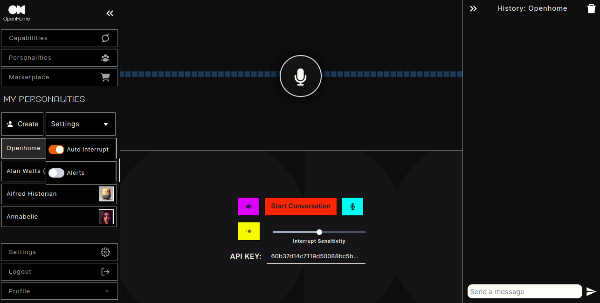

## Accessing the OpenHome Dashboard

### Login:
- Go to the OpenHome Dashboard.
- Enter your Email and Password.
- Click `Log in` to access your account.
- Alternatively, you can sign in using your Google account by clicking `Sign in with Google`.

### New User Registration:
- If you're new to OpenHome, click `Sign up` to create a new account.
- You can also sign up using your Google account.


## Navigating the Home Page

### Home Dashboard Overview
- **Capabilities:** Access default capabilities provided by OpenHome.
- **Personalities:** View and manage preinstalled personalities.
- **Marketplace:** Browse additional personalities and capabilities.
### Using the Dashboard
- **Start Conversation:** Click the red button to initiate a new conversation.
- **Audio & Mic:** Use the purple button to turn off audio and the sky blue button to mute your mic.
- **Manual Interrupt:** The yellow button allows manual interruptions. Adjust sensitivity using the slider.
- **API Key:** Your unique API key is displayed at the bottom.
- **Conversation Modes:** You can have text-based conversations using the box on the lower right side.
- **History:** Review your conversation history on the upper right side.
- **Settings:** Located on the lower left, configure SDK settings and adjust your profile.




### Managing Personalities

#### Create:
- Create a new personality by clicking the `+ Create` button.
- **Settings:** Adjust alerts and other settings for each personality.

## Personalities Page

The Personalities page allows you to view, manage, and create custom AI personalities. You can also add new voices to customize the interaction experience further.

### Managing Personalities
- **Search:** Use the search bar to find specific personalities quickly.
- **Edit or Delete:** Use the icons next to each personality to edit or delete them.

### Create New Personality:
- Click `Add New Personality`.
- Fill in the required fields: Name, Cold Start Message, Description.
- Upload a Personality Image if desired.
- Click `Save` to add the personality.


### Advanced Information:
- **Purpose:** Define the purpose of the personality, explaining its intended use or function.
- **Voice ID:** Select a voice from the dropdown list to use for this personality.
- **Text to Speech:** Write text and click on the play button to hear the selected voice.

### Finalizing:
- Click `More Options` to explore additional settings.
- Click `Save` to finalize the personality setup.
- If you need to cancel the process, click `Cancel`.


### Add New Voice:
- Click `Add New Voice id`.
- Provide the Name, Description, and Voice ID.
- Click `Save` to apply the new voice.


### Additional Actions
- **Play:** Preview the personality by clicking the play icon.
- **Share:** Share a personality with others.
- **Reset:** Reset a personality's settings to default.


## Capabilities Page

The Capabilities page allows you to manage and customize the functionalities available in OpenHome. You can view installed capabilities, add new ones, and configure trigger words.

### Managing Capabilities
- **Tabs:**
  - **My Capabilities:** View all custom capabilities you have created.
  - **Published Capabilities:** View all custom capabilities you have published.
  - **Installed Capabilities:** Manage all installed capabilities.

### Capability Controls:
- **Enable/Disable:** Toggle a capability on or off.
- **Agent/System Capability:** Specify the type of capability.
- **Trigger Words:** Add or remove words/phrases that trigger the capability.
- **Uninstall:** Remove a capability from your system.


### Add New Capability

#### Basic Information:
- **Capability Name:** Enter the name of the capability.
- **Description:** Provide a description of what the capability does.
- **Image Upload:** Upload an icon to represent the capability.
- **File Upload:** Upload a `.zip` file containing the capability code.
- **Trigger Words:** Add words or phrases that will trigger this capability.

#### Finalizing:
- Click `Submit` to add the new capability.
- Click `Cancel` if you wish to discard the changes.


## Marketplace

The Marketplace page in OpenHome allows you to browse, install, and manage various personalities and capabilities to enhance your experience.

### Capabilities Marketplace
- **Browse Capabilities:** View available capabilities, including their descriptions, triggers, and ratings.
- **Install/Uninstall:** Click `Install` to add a capability or `Uninstall` to remove it.
- **Search:** Use the search bar to find specific capabilities quickly.

### Personalities Marketplace
- **Browse Personalities:** Discover a variety of AI personalities, complete with ratings and key features.
- **Install:** Click `Install` to add a personality to your collection.
- **Featured Personalities:** Explore highlighted personalities with detailed descriptions and ratings.

### Navigation
- **Pagination:** Use the pagination controls to navigate through different pages of capabilities or personalities.
- **Filters:** Apply filters to narrow down your search results.


## Setup your development

Learn how to update your docs locally and and deploy them to the public.

### Edit and preview

<AccordionGroup>
  <Accordion icon="github" title="Clone your docs locally">
    During the onboarding process, we created a repository on your Github with
    your docs content. You can find this repository on our
    [dashboard](https://dashboard.mintlify.com). To clone the repository
    locally, follow these
    [instructions](https://docs.github.com/en/repositories/creating-and-managing-repositories/cloning-a-repository)
    in your terminal.
  </Accordion>
  <Accordion icon="rectangle-terminal" title="Preview changes">
    Previewing helps you make sure your changes look as intended. We built a
    command line interface to render these changes locally. 1. Install the
    [Mintlify CLI](https://www.npmjs.com/package/mintlify) to preview the
    documentation changes locally with this command: ``` npm i -g mintlify ```
    2. Run the following command at the root of your documentation (where
    `mint.json` is): ``` mintlify dev ```
  </Accordion>
</AccordionGroup>

### Deploy your changes

<AccordionGroup>

<Accordion icon="message-bot" title="Install our Github app">
  Our Github app automatically deploys your changes to your docs site, so you
  don't need to manage deployments yourself. You can find the link to install on
  your [dashboard](https://dashboard.mintlify.com). Once the bot has been
  successfully installed, there should be a check mark next to the commit hash
  of the repo.
</Accordion>
<Accordion icon="rocket" title="Push your changes">
  [Commit and push your changes to
  Git](https://docs.github.com/en/get-started/using-git/pushing-commits-to-a-remote-repository#about-git-push)
  for your changes to update in your docs site. If you push and don't see that
  the Github app successfully deployed your changes, you can also manually
  update your docs through our [dashboard](https://dashboard.mintlify.com).
</Accordion>

</AccordionGroup>

## Update your docs

Add content directly in your files with MDX syntax and React components. You can use any of our components, or even build your own.

<CardGroup>

<Card title="Style Your Docs" icon="paintbrush" href="/settings/global">
  Add flair to your docs with personalized branding.
</Card>

<Card
  title="Add API Endpoints"
  icon="square-code"
  href="/api-playground/configuration"
>
  Implement your OpenAPI spec and enable API user interaction.
</Card>

<Card
  title="Integrate Analytics"
  icon="chart-mixed"
  href="/analytics/supported-integrations"
>
  Draw insights from user interactions with your documentation.
</Card>

<Card
  title="Host on a Custom Domain"
  icon="browser"
  href="/settings/custom-domain/subdomain"
>
  Keep your docs on your own website's subdomain.
</Card>

</CardGroup>
