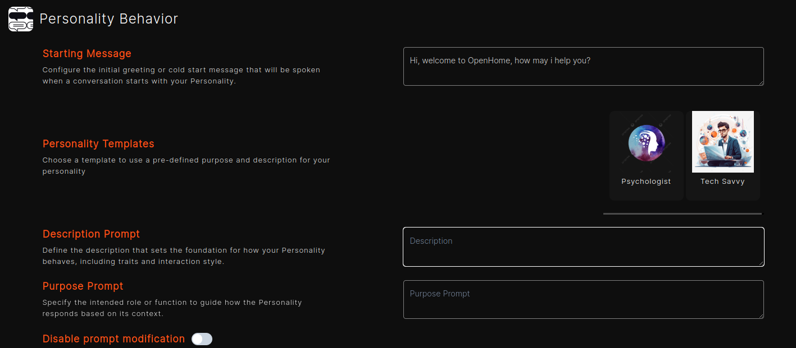
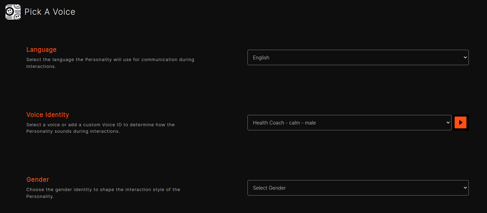
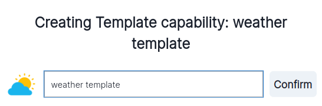
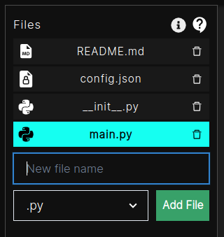
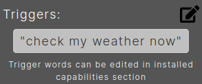

## Accessing the OpenHome Dashboard

### Login
- Go to the OpenHome Dashboard.
- Enter your Email and Password.
- Click `Log in` to access your account.
- Alternatively, you can sign in using your Google account by clicking `Sign in with Google`.

### New User Registration
- If you're new to OpenHome, click `Sign up` to create a new account.
- You can also sign up using your Google account.

## Navigating the Home Page

### Home Dashboard Overview
- **Abilities:** Access default Abilities provided by OpenHome.
- **Personalities:** View and manage pre-installed personalities.
- **Marketplace:** Browse additional personalities and Abilities.

### Using the Dashboard

#### Start Conversation
To start a conversation, simply navigate to the left sidebar and select one of the available personalities under "My Conversations." Just click on the personality you'd like to interact with, and you'll be ready to engage in a dynamic and personalized chat. 

- **Start Conversation:** The conversation will start automatically, ensuring enhance user experience. If you wish to end the conversation, simply click the orange button to stop. To start a new conversation, click the green button and continue the interaction.
- **Audio & Mic:** Use the left sky blue button to turn off speaker and right sky blue button to mute your mic.
- **Interrupt:** The interrupt button allows manual interruptions.
- **Conversation Modes:** Switch to audio-based conversations by toggling the mode button to "on." Text mode is the default, but feel free to choose audio anytime for a more dynamic experience.
- **History:** Review your conversation history displayed in the center.
- **Settings:** The profile can be found in the lower-left corner. To configure the SDK settings, simply navigate to "Settings."
- **Date functionality:** The calendar button located below the conversation will activate the date functionality.

#### Personality Settings
The Personality Settings panel, located on the right side of the conversation window, offers you the flexibility to adjust and fine-tune personality-related preferences. It includes options for Conversation, Behavior, and Identity Controls.

- **Conversation Settings:** Adjust conversation interaction by toggling **Auto Interrupt** ON/OFF to control automatic interruptions, enabling/disabling **Alerts** for notifications, and setting the **Interrupt Sensitivity** level using a slider to control how quickly interruptions occur based on cues.

  

- **Behavior Controls:** Customize the greeting by crafting a personalized **Starting Message**, define personality traits through a **Descriptive Prompt**, and establish the role of the personality with a clear **Purpose Prompt**.

  

- **Identity Controls:** Select the voice and language based on your personality preferences to create a more personalized and engaging experience.

  

## Personalities Page

The Personalities page allows you to view, manage, and create custom AI personalities. You can also add new voices to customize the interaction experience further.

### Managing Personalities
- **Search:** Use the search bar to find specific personalities quickly.
- **Edit or Delete:** Use the icons below the personality name to edit or delete them.

### Create New Personality
- In the left sidebar, click on "Create" and choose "Personalities" to get started.
- Fill in the required categories: Personality Information, Personality Behavior, and Pick A Voice.
- **Personality Information:** This information is intended specifically for the Marketplace. Include the personality name, a brief description of the marketplace, an image, and key features of the personality.

  

- **Personality Behavior:** Clearly outlining how the personality interacts and responds, this includes an introductory message, a detailed description of the personality, and its intended purpose or role.

  

- **Pick A Voice:** Effectively select a language from the provided list and identify a voice that aligns with the desired personality and gender. Additionally, you have the option to test the chosen voice.

  

- Click `Save Personality` to add the personality.

## Abilities Page

The Abilities page allows you to manage and customize the functionalities available in OpenHome. You can view installed Abilities, add new ones, and configure trigger words.

### Managing Abilities
- **Tabs:**
  - **My Abilities:** View all custom Abilities you have created.
  - **Published Abilities:** View all custom Abilities you have published.
  - **Installed Abilities:** Manage all installed Abilities.
  - **Add Custom Ability:** Upload a .zip file containing your code to create a custom ability.
  - **Live Editor:** Enhance your created ability by utilizing the live editor for real-time modifications and improvements.

### Ability Controls
- **Enable/Disable:** Toggle a Ability on or off.
- **Agent/System Ability:** Specify the type of Ability.
- **Trigger Words:** Add or remove words/phrases that trigger the Ability.
- **Uninstall:** Remove a Ability from your system.

### Add New Ability

- In the left sidebar, click on "Create" and choose "Abilities" to get started.
- **Ability Information:** Efficiently present the ability’s name, a comprehensive description, and an image to enhance its visibility in the marketplace.

  

- **Ability Behavior:** Upload a .zip file containing the Ability code and specify the Trigger Words or phrases that will activate this Ability. Additionally, you have the option to choose from built-in templates.

  

#### Finalizing
- Click `Save Ability` to add the new Ability.

## Marketplace

The Marketplace page in OpenHome allows you to browse, install, and manage various personalities and Abilities to enhance your experience.

### Abilities Marketplace
- **Browse Abilities:** View available Abilities, along with the number of installs and user ratings.
- **Install/Uninstall:** Click `Try It` to add a Ability or `Uninstall` to remove it.
- **Search:** Use the search bar to find specific Abilities quickly.

### Personalities Marketplace
- **Browse Personalities:** Discover a variety of AI personalities, along with the number of installs and complete with ratings.
- **Install:** Click `Install` to add a personality to your collection.
- **Featured Personalities:** Explore highlighted personalities with detailed descriptions and ratings.

### Navigation
- **Pagination:** Use the pagination controls to navigate through different pages of Abilities or personalities.
- **Filters:** Apply filters to narrow down your search results.

### Template Abilities
- **Built-In:** These are default templates for built-in capabilities.

#### Try Template Abilities
Click the `try it` button, A pop-up will appear where you should enter the name provided next to "Creating Template Capability." 

  

After confirming, you will be redirected to the live editor, where you can either make changes or proceed without making any adjustments.

  

**Modify Files:** You can create, delete or modify files easily.

  

**Trigger keywords:** Trigger keywords can be checked using this button 

You can also click on edit button in  to modify, add or remove trigger keywords 

  

**Editor Options:**

-  **Commit**: Commit you changes as a new release.
-  **Discard Changes**: Discard your current changes.
-  **Save Changes**: Save your current changes.
-  **Revert**: Revert your changes to initial release.
-  **Download Folder**: Download the ability code as a zip folder in.
-  **Start Live Test**: Test your changes live here.
-  **Mic**: Turn on/off microphone.
-  **Speaker**: Turn on/off speaker.
